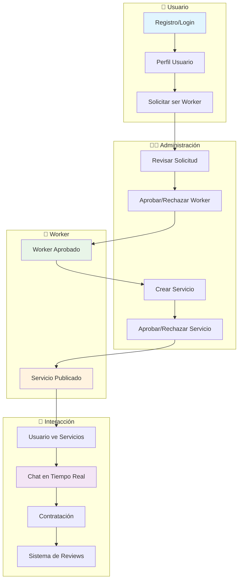

<div align="center">

# 🚀 Servicios Libres - Backend API


### Plataforma de servicios que conecta usuarios con trabajadores especializados

[](https://nestjs.com/)
[](https://www.typescriptlang.org/)
[](https://www.postgresql.org/)

</div>

---

## 🛠️ Stack Tecnológico

<table align="center">
<tr>
<td align="center" width="200">

<br><strong>NestJS 11.x</strong>
<br><em>Framework Backend</em>
</td>
<td align="center" width="200">

<br><strong>TypeScript 5.7.3</strong>
<br><em>Lenguaje Principal</em>
</td>
<td align="center" width="200">

<br><strong>PostgreSQL 14+</strong>
<br><em>Base de Datos</em>
</td>
</tr>
<tr>
<td align="center" width="200">

<br><strong>TypeORM 0.3.x</strong>
<br><em>ORM Database</em>
</td>
<td align="center" width="200">

<br><strong>Socket.io 4.8</strong>
<br><em>WebSockets</em>
</td>
<td align="center" width="200">

<br><strong>Cloudinary</strong>
<br><em>Almacenamiento</em>
</td>
</tr>
<tr>
<td align="center" width="200">

<br><strong>JWT</strong>
<br><em>Autenticación</em>
</td>
<td align="center" width="200">

<br><strong>Swagger</strong>
<br><em>Documentación API</em>
</td>
<td align="center" width="200">

<br><strong>Nodemailer</strong>
<br><em>Email Service</em>
</td>
</tr>
</table>

---

## 💳 Pasarelas de Pago

<div align="center">

<table>
<tr>
<td align="center" width="200">

<br><strong>Stripe</strong>
<br><em>Pagos Internacionales</em>
</td>
<td align="center" width="200">

<br><strong>MercadoPago</strong>
<br><em>Pagos Locales</em>
</td>
</tr>
</table>
</div>

---

## 🚀 Comandos Importantes

### 📦 Instalación
```bash
# Clonar repositorio
git clone https://github.com/Servicios-Libre/backend
cd backend

# Instalar dependencias
npm install
```

### ⚙️ Configuración
```bash
# Copiar variables de entorno
cp .env.example .env

# Configurar base de datos PostgreSQL
createdb servicios_libre

# Ejecutar migraciones
npm run migration:run
```

### 🏃‍♂️ Desarrollo
```bash
# Modo desarrollo con hot reload
npm run start:dev

# Modo debug
npm run start:debug

# Compilar para producción
npm run build

# Ejecutar en producción
npm run start:prod
```

### 🧪 Testing
```bash
# Tests unitarios
npm run test

# Tests e2e
npm run test:e2e

# Coverage
npm run test:cov
```

### 🗄️ Base de Datos
```bash
# Generar migración
npm run migration:generate -- src/migrations/MigrationName

# Crear migración vacía
npm run migration:create -- src/migrations/MigrationName

# Revertir migración
npm run migration:revert

# Ver estado migraciones
npm run migration:show
```

---

## 🌐 Inicialización y Deploy

### 🏠 Desarrollo Local
```bash
# 1. Configurar variables de entorno
cp .env.example .env

# 2. Instalar dependencias
npm install

# 3. Configurar base de datos
createdb servicios_libre
npm run migration:run

# 4. Iniciar servidor
npm run start:dev
```

**🔗 Servidor local:** `http://localhost:8080`  
**📚 Documentación API:** `http://localhost:8080/api`

### 🚀 Deploy en Producción

<div align="center">

**🔗 Deploy URL:** [https://back-servicio-libre.onrender.com/api](https://back-servicio-libre.onrender.com/api)

[](https://serviciolibre-backend.onrender.com)

**⚡ Acceso rápido:** `Ctrl+Click` en el enlace de arriba

</div>

---

## 🔄 Flujo de la Aplicación

<div align="center">



</div>

### 📋 Proceso Detallado

1. **🔐 Autenticación:** Los usuarios se registran y obtienen JWT tokens
2. **👤 Gestión de Usuarios:** Perfiles con roles (Usuario/Worker/Admin)
3. **📝 Solicitud Worker:** Los usuarios solicitan convertirse en workers
4. **✅ Aprobación Admin:** Los administradores aprueban solicitudes
5. **🛠️ Creación de Servicios:** Workers crean servicios por categorías
6. **📋 Aprobación de Servicios:** Los servicios requieren aprobación admin
7. **💬 Chat en Tiempo Real:** Comunicación instantánea vía WebSockets
8. **⭐ Sistema de Reviews:** Calificaciones y comentarios post-servicio
9. **📧 Notificaciones:** Emails automáticos para eventos importantes

---

## 📁 Estructura del Proyecto

```
src/
├── 📁 config/           # Configuraciones (DB, JWT, Cloudinary)
├── 📁 modules/          # Módulos de negocio
│   ├── 🔐 auth/         # Autenticación y autorización
│   ├── 👤 users/        # Gestión de usuarios
│   ├── 🛠️ workerServices/ # Servicios de workers
│   ├── 📂 categories/   # Categorías de servicios
│   ├── 🎫 tickets/      # Sistema de aprobaciones
│   ├── 💬 chat/         # Chat en tiempo real
│   ├── ⭐ reviews/      # Sistema de reseñas
│   ├── 📁 files/        # Subida de archivos
│   └── 📧 email/        # Servicio de emails
├── 📄 app.module.ts     # Módulo principal
└── 🚀 main.ts          # Punto de entrada
```

---

## 📚 Documentación API

La documentación completa de la API está disponible en:

**🔗 Swagger UI:** `/api` (cuando el servidor esté ejecutándose)

### 🔑 Autenticación
- `POST /auth/signup` - Registro de usuario
- `POST /auth/signin` - Login y obtención de JWT

### 👤 Usuarios
- `GET /users/byId` - Obtener perfil por token
- `POST /users/update` - Actualizar datos de usuario

### 🛠️ Servicios
- `GET /services` - Listar servicios (paginado)
- `GET /services/categories` - Obtener categorías
- `POST /services/new` - Crear nuevo servicio

### 📁 Archivos
- `POST /files/user` - Subir foto de perfil
- `POST /files/service/:id` - Subir fotos de trabajo

---

<div align="center">

## 🤝 Contribución

¿Quieres contribuir? ¡Genial! 

1. Fork el proyecto
2. Crea tu rama (`git checkout -b feature/AmazingFeature`)
3. Commit tus cambios (`git commit -m 'Add some AmazingFeature'`)
4. Push a la rama (`git push origin feature/AmazingFeature`)
5. Abre un Pull Request

---

**📧 Contacto:** [Equipo Servicios Libres](mailto:contact@servicioslibre.com)

[](https://github.com/Servicios-Libre)

</div>
